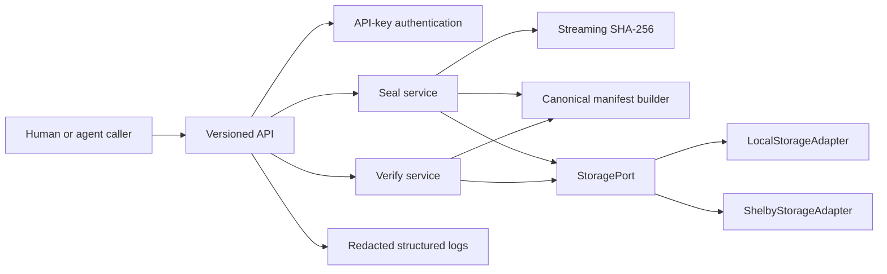

# ProofVault Architecture

## Architectural outcome

ProofVault is a TypeScript application with a versioned HTTP API, a small web client, and a storage boundary implemented by both a deterministic local adapter and a Shelby adapter. Business logic must not depend directly on SDK-specific types.



## Recommended stack

- Node.js 22 LTS or the latest LTS supported by the Shelby SDK; pin the selected version.
- TypeScript with strict mode.
- Next.js App Router for the dashboard and route handlers, unless Shelby SDK runtime constraints require a separate Fastify service. Decide after a minimal SDK import spike.
- `@shelby-protocol/sdk` and `@aptos-labs/ts-sdk` only inside the Shelby adapter.
- Zod for request, environment, manifest, and response validation.
- Vitest for unit and contract tests.
- Playwright only after a dashboard prototype is approved.
- pnpm with a committed lockfile.

## Module boundaries

```text
src/
  domain/
    manifest.ts
    receipt.ts
    errors.ts
  application/
    seal-collection.ts
    verify-collection.ts
    recover-collection.ts
  ports/
    storage-port.ts
    collection-index-port.ts
    clock-port.ts
  adapters/
    local-storage-adapter.ts
    shelby-storage-adapter.ts
    sqlite-collection-index.ts
  api/
    schemas.ts
    auth.ts
    routes/
  observability/
    logger.ts
```

## Storage contracts

`StoragePort` is the only artifact persistence dependency available to application services:

```ts
export interface StoragePort {
  put(input: {
    key: string;
    body: ReadableStream<Uint8Array> | AsyncIterable<Uint8Array>;
    contentType: string;
    expiresAt: string;
    idempotencyKey: string;
  }): Promise<{ key: string; size: number; providerRef?: string }>;

  get(key: string): Promise<{
    body: ReadableStream<Uint8Array> | AsyncIterable<Uint8Array>;
    contentType: string;
    size?: number;
  }>;

  exists(key: string): Promise<boolean>;
}
```

The local and Shelby adapters must pass the same contract suite. Provider references are diagnostic metadata, not authorization secrets.

## Persistence model

Shelby stores artifact bytes and canonical manifests. A small collection index stores ownership, receipt digest, manifest storage key, idempotency key, expiration, status, and timestamps. SQLite is acceptable locally; the production database remains an explicit deployment decision. Database rows are an index, not the artifact source of truth.

Collection lifecycle:

```text
receiving -> storing_artifacts -> storing_manifest -> sealed
      |              |                  |
      +--------------+------------------+-> failed
sealed -> verifying -> verified | incomplete | invalid | expired
```

## Canonicalization and integrity

- Hash exact file bytes while streaming; do not load entire files into memory.
- Normalize and validate filenames before deriving storage keys.
- Sort manifest artifacts by their stable artifact ID before canonical serialization.
- Hash the canonical manifest without its own `manifestSha256` field, then add that digest to the receipt.
- The receipt identifies the manifest by collection ID, manifest storage key, manifest SHA-256, version, and expiration.
- Never treat a database status field alone as proof of artifact integrity.

## Failure and retry model

- Validation and authorization failures are terminal.
- Network timeouts, rate limits, and documented Shelby transient errors are retryable with bounded exponential backoff and jitter.
- A seal request requires an idempotency key. Retrying the same key with a different request digest returns `409 IDEMPOTENCY_CONFLICT`.
- Partial uploads remain quarantined and are never returned as sealed collections.
- Reconciliation may complete or mark abandoned partial work; it must not silently create a second collection.

## Environment boundary

Local development defaults to `STORAGE_DRIVER=local`. `STORAGE_DRIVER=shelby` is allowed only when testnet configuration is present and validated. Application startup must fail closed if a selected driver's required environment variables are missing.

## UI gate

The dashboard is a major new UI. CommandCode may scaffold routing and a non-styled diagnostic page, but production UI implementation is blocked until a representative upload-to-receipt prototype is reviewed and approved.
